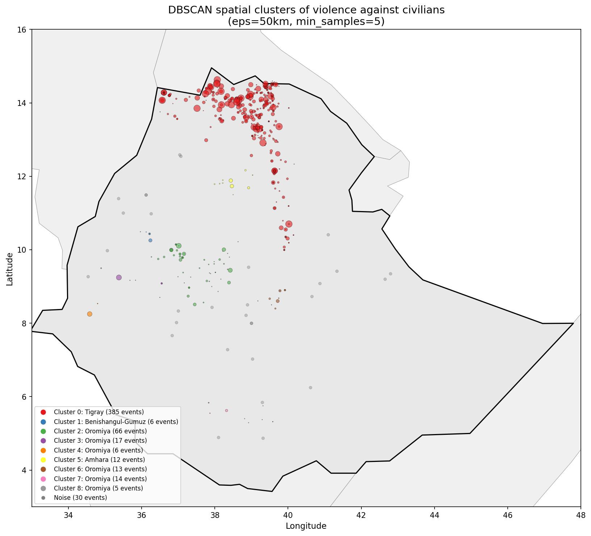
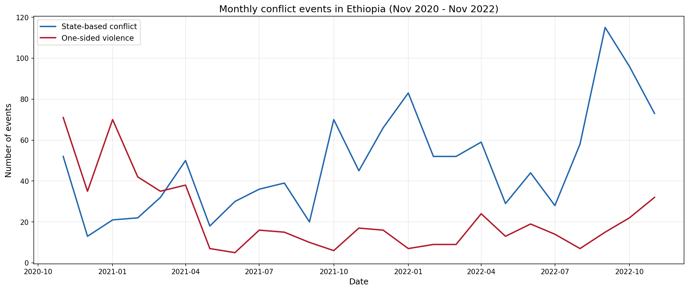
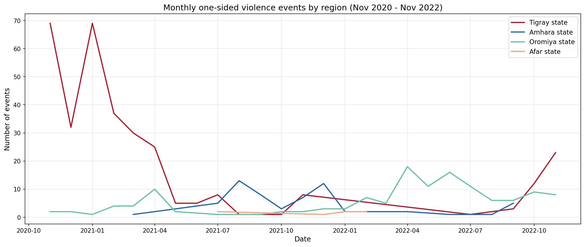
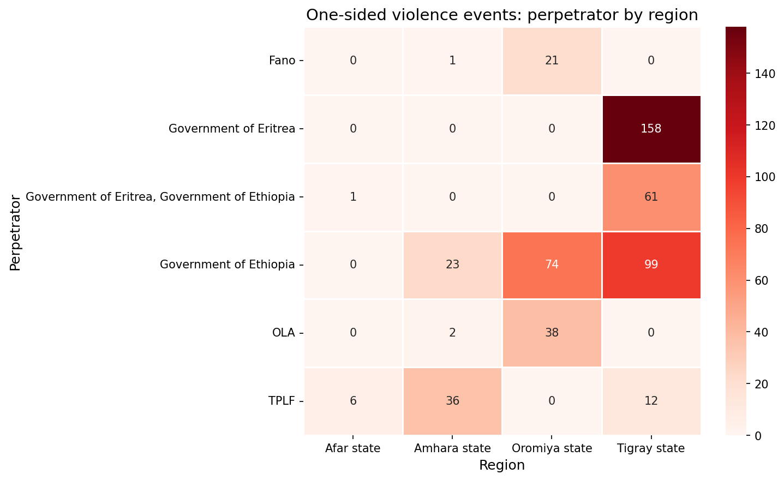
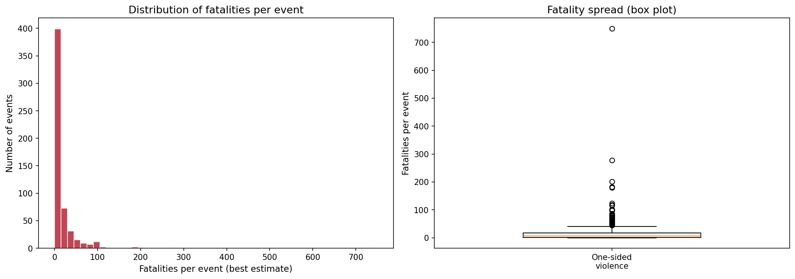
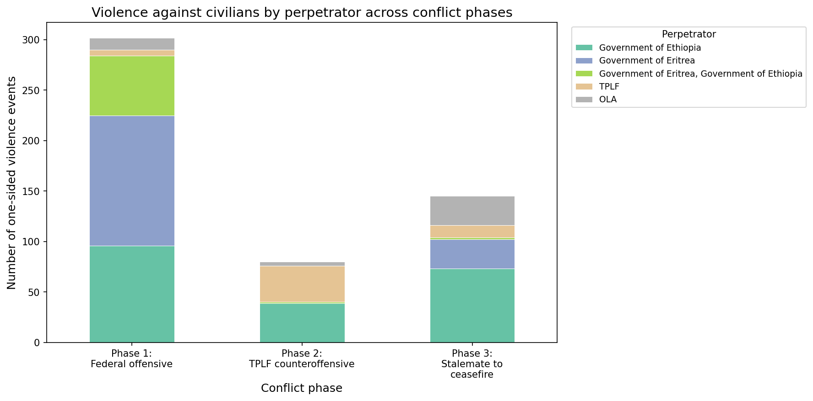
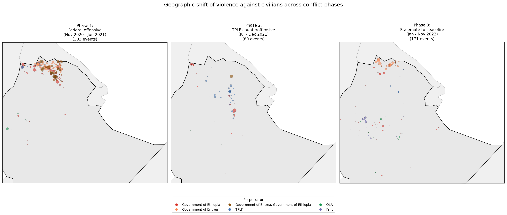
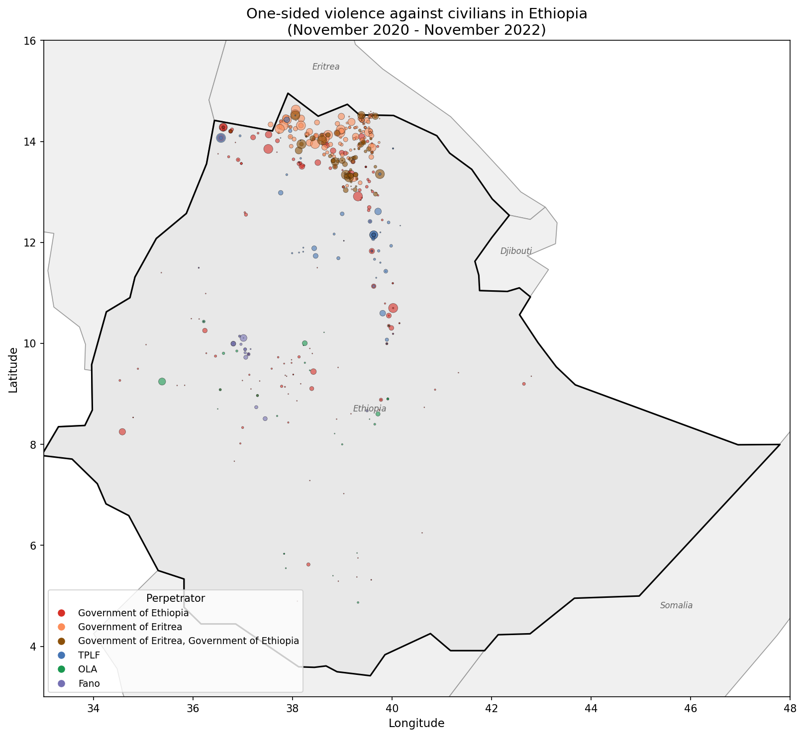

# Conflict Event Data Analysis and Geospatial Visualization

## Research Question

How does violence against civilians cluster spatially and temporally during the Tigray conflict (November 2020 to November 2022)?

## Navigation

| Section | Description |
|---------|-------------|
| [Motivation](#motivation) | Why disaggregated conflict event analysis matters |
| [Key Findings](#key-findings) | Main results across all analyses |
| [Data](#data-sources) | UCDP GED v25.1 filtered to 1,764 Ethiopia events |
| [Methods](#methods) | EDA, geospatial visualization, DBSCAN clustering |
| [Results in Detail](#results-in-detail) | Figures and interpretation for each analytical step |
| [Notebooks](#notebooks) | Analytical progression |
| [How to Reproduce](#how-to-reproduce) | Setup and replication instructions |
| [References](#key-references) | Academic sources |

## Motivation

Conflict research increasingly depends on disaggregated, geocoded event data. Datasets like UCDP GED and ACLED now record individual events of organized violence with precise coordinates, dates, actors, and fatality estimates. This granularity allows researchers to move beyond country-level analysis toward spatially and temporally explicit studies of how violence unfolds within conflicts.

The Tigray conflict (November 2020 to November 2022) is a strong case for this approach. The conflict involved multiple armed actors (Ethiopian federal forces, Eritrean forces, TPLF, Amhara militias), shifted geographically across three regions, and produced distinct phases with different patterns of violence against civilians. This project applies spatial analysis and density-based clustering to identify where and when civilian targeting concentrated, which actors were responsible, and how violence shifted as the conflict evolved.

## Key Findings

**Violence against civilians was extensive.** 554 events of one-sided violence resulted in an estimated 9,324 civilian deaths over two years. This accounts for 31% of all conflict events in Ethiopia during the study period.

**Government forces committed the majority of documented civilian targeting.** The Government of Ethiopia (208 events), Government of Eritrea (158), and joint Ethiopian-Eritrean forces (62) account for 77% of one-sided violence. TPLF committed 54 events, OLA 45, and Fano militia 25.

**Violence concentrated in one dominant spatial cluster.** DBSCAN identified 9 clusters. A single cluster in Tigray contains 385 events (69% of all one-sided violence) with 8,444 fatalities. Only 30 events (5.4%) were classified as spatial noise.

**Violence shifted geographically across three conflict phases.** Phase 1 (federal offensive) concentrated in Tigray. Phase 2 (TPLF counteroffensive) spread to Amhara and Afar. Phase 3 (stalemate to ceasefire) saw violence return toward Tigray.

**Oromiya violence reflects a parallel insurgency.** 615 of 1,764 total events occurred in Oromiya, driven by the separate OLA insurgency rather than the Tigray conflict.



## Data Sources

| Dataset | Source | Role |
|---------|--------|------|
| UCDP GED v25.1 | Uppsala University | 385,918 global events of organized violence (1989-2024) |

**Filtered sample:** 1,764 events in Ethiopia, November 2020 to November 2022.

| Violence Type | Events | Fatalities (best estimate) |
|---------------|--------|---------------------------|
| State-based conflict (type 1) | 1,203 | 308,647 |
| Non-state conflict (type 2) | 7 | 395 |
| One-sided violence (type 3) | 554 | 9,324 |

**Key UCDP variables used:** type_of_violence, side_a, side_b, date_start, latitude, longitude, adm_1, adm_2, best/low/high fatality estimates, deaths_civilians.

UCDP data is not redistributed in this repository. See data/README.md for download instructions.

## Methods

- **Exploratory Data Analysis**: Event counts by violence type, region, actor, and conflict phase. Fatality distributions and identification of mass atrocity events.
- **Temporal Decomposition**: Monthly event time series broken down by violence type, region, and perpetrator across three conflict phases (federal offensive, TPLF counteroffensive, stalemate to ceasefire).
- **Geospatial Visualization**: Static maps with geopandas showing event locations colored by perpetrator. Phase-comparison maps showing geographic shift of violence. Interactive folium map with clickable events.
- **DBSCAN Clustering**: Density-based spatial clustering using haversine distance (eps = 50km, min_samples = 5) to identify statistically significant concentrations of violence against civilians.

## Results in Detail

### Temporal Patterns: Violence by Type

State-based conflict and one-sided violence follow similar temporal arcs but with important differences. One-sided violence peaks earlier in the conflict, consistent with the pattern of civilian massacres during the initial federal offensive into Tigray.



### Regional Breakdown of Civilian Targeting

Tigray saw the most sustained violence against civilians throughout the conflict. Amhara and Afar experienced spikes during Phase 2 when TPLF forces advanced beyond Tigray's borders. Oromiya's one-sided violence follows a separate pattern driven by the OLA insurgency.



### Perpetrator-Region Heatmap

Government forces (Ethiopia and Eritrea) concentrated civilian targeting in Tigray. TPLF committed one-sided violence primarily in Amhara during the counteroffensive. OLA operated exclusively in Oromiya. This geographic separation of perpetrators reflects the distinct operational zones of each armed actor.



### Fatality Distribution

Most one-sided violence events involve small numbers of fatalities, but a long tail of mass atrocity events drives the aggregate death toll. Understanding this distribution matters for interpreting both the event counts and the total civilian death estimates.



### Violence by Perpetrator Across Conflict Phases

The composition of perpetrators shifts across phases. Government of Ethiopia and Eritrea dominate Phase 1. TPLF appears as a perpetrator in Phase 2 during the counteroffensive. Phase 3 shows reduced overall violence before the ceasefire.



### Geographic Shift Across Conflict Phases

Three maps show how violence against civilians moved across space as the conflict evolved. Phase 1 is concentrated in Tigray. Phase 2 spreads south and east into Amhara and Afar. Phase 3 contracts back toward Tigray.



### Static Map: All One-Sided Violence Events

Every one-sided violence event mapped by perpetrator (color) and fatality count (size). The concentration in Tigray is visible, along with the separate OLA cluster in Oromiya and scattered events in Amhara and Afar.



### DBSCAN Spatial Clustering

Nine clusters identified. Cluster 0 (Tigray) dominates with 385 events and 8,444 fatalities. Remaining clusters capture the OLA insurgency in Oromiya, TPLF violence in Amhara, and isolated patterns in Benishangul-Gumuz.


| Cluster | Events | Fatalities | Main Region | Main Perpetrator |
|---------|--------|------------|-------------|------------------|
| 0 | 385 | 8,444 | Tigray | Government of Eritrea |
| 1 | 6 | 40 | Benishangul-Gumuz | Government of Ethiopia |
| 2 | 66 | 454 | Oromiya | Government of Ethiopia |
| 3 | 17 | 78 | Oromiya | OLA |
| 4 | 6 | 52 | Oromiya | Government of Ethiopia |
| 5 | 12 | 89 | Amhara | TPLF |
| 6 | 13 | 68 | Oromiya | OLA |
| 7 | 14 | 21 | Oromiya | Government of Ethiopia |
| 8 | 5 | 5 | Oromiya | Government of Ethiopia |
| Noise | 30 | 73 | Various | Various |

## Project Structure

```
conflict-event-analysis/
├── data/
│   ├── GEDEvent_v25_1.csv    # UCDP GED (not tracked)
│   └── README.md             # Download instructions
├── notebooks/
│   └── 01_exploratory_analysis.ipynb
├── outputs/                  # All figures and maps
├── src/
│   ├── __init__.py
│   └── data_loader.py        # Reusable data pipeline
├── .gitignore
├── README.md
└── requirements.txt
```

## Notebooks

| Notebook | Description | Key Output |
|----------|-------------|------------|
| 01 Exploratory Analysis | Data loading, filtering, temporal patterns, regional breakdowns, perpetrator analysis, fatality distributions, conflict phase analysis, DBSCAN clustering | 1,764 events filtered, 9 spatial clusters, 8 figures |

## How to Reproduce

1. Download UCDP GED v25.1 from https://ucdp.uu.se/downloads/ and place the CSV in `data/`
2. Install dependencies: `pip install -r requirements.txt`
3. Run the notebook: `notebooks/01_exploratory_analysis.ipynb`

## Key References

- Sundberg, R. and Melander, E. (2013). Introducing the UCDP Georeferenced Event Dataset. *Journal of Peace Research*, 50(4), 523-532.
- Gleditsch, K.S. and Weidmann, N.B. (2012). Richardson in the Information Age: GIS and Spatial Data in International Studies. *Annual Review of Political Science*, 15, 461-481.
- Deutschmann, E. et al. (eds.) (2020). *Computational Conflict Research*. Springer.
- Hegre, H. et al. (2019). ViEWS: A Political Violence Early-Warning System. *Journal of Peace Research*, 56(2), 155-174.
- Davies, S., Pettersson, T., Sollenberg, M., and Oberg, M. (2025). Organized violence 1989-2024, and the challenges of identifying civilian victims. *Journal of Peace Research*, 62(4).
- Kelling, C. and Lin, Y. (2020). Analysis of Conflict Diffusion Over Continuous Space. In *Computational Conflict Research*, Springer.

## Skills Demonstrated

Conflict event data acquisition and cleaning, temporal aggregation and decomposition, geospatial visualization with geopandas and folium, density-based spatial clustering (DBSCAN) with haversine distance, actor-disaggregated conflict analysis, publication-quality static mapping, interactive web mapping, GitHub project management.

## Portfolio Context

| Project | Topic | Status |
|---------|-------|--------|
| 1 | **Conflict Event Data Analysis and Geospatial Visualization** (this repo) | **Complete** |
| 2 | [LLM-Powered Conflict Text Analysis](https://github.com/Sezibra/conflict-text-analysis) | Complete |
| 3 | [Conflict Actor Network Analysis](https://github.com/Sezibra/conflict-network-analysis) | Complete |
| 4 | [Conflict Forecasting with Machine Learning](https://github.com/Sezibra/conflict-forecasting-ml) | Complete |
| 5 | [Causal Inference for Conflict with ML](https://github.com/Sezibra/conflict-causal-inference) | Complete |
| 6 | [Satellite Imagery for Conflict Damage Assessment](https://github.com/Sezibra/conflict-satellite-damage) | Complete |
